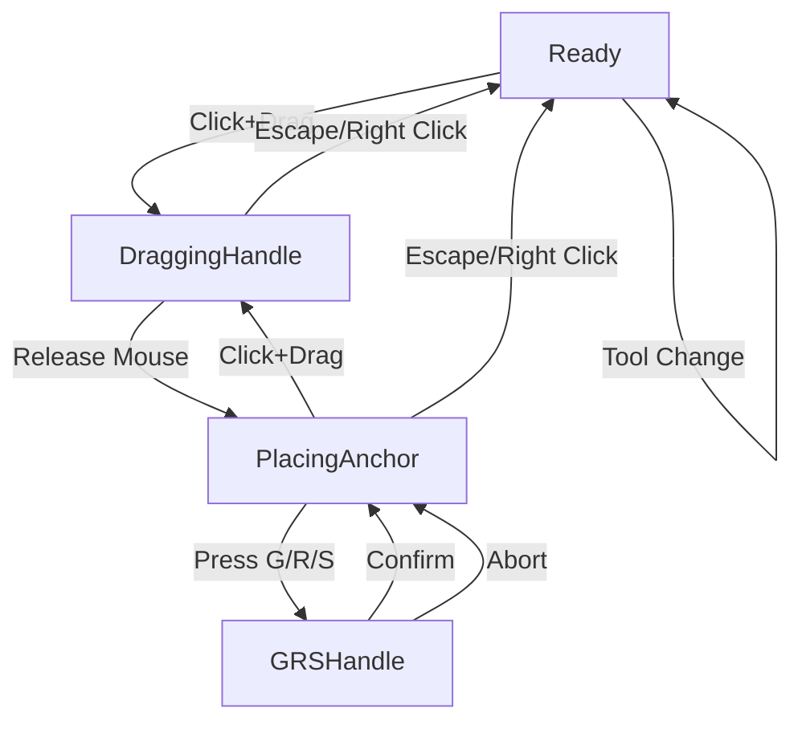

# Graphite Pen Tool: Complete Architecture Guide

## Table of Contents
1. [Overview](#overview)
2. [What is a Finite State Machine (FSM)?](#what-is-a-finite-state-machine-fsm)
3. [Pen Tool Architecture](#pen-tool-architecture)
4. [FSM Implementation](#fsm-implementation)
5. [Handle System](#handle-system)
6. [Vector Path Creation Process](#vector-path-creation-process)
7. [Snapping System](#snapping-system)
8. [User Interface Integration](#user-interface-integration)
9. [Key Bindings](#key-bindings)
10. [Advanced Features](#advanced-features)
11. [Code Examples](#code-examples)
12. [Benefits of FSM Approach](#benefits-of-fsm-approach)

## Overview

The Pen Tool is one of Graphite's most sophisticated interactive tools, designed for creating vector paths with Bézier curves. It demonstrates excellent software engineering practices through its use of a Finite State Machine (FSM) architecture, making complex interactive behavior manageable and predictable.

**Key Features:**
- Professional-grade Bézier curve creation
- Smart handle manipulation with multiple modes
- Advanced snapping system
- Path extension and merging capabilities
- Real-time visual feedback
- Non-destructive editing integration

## What is a Finite State Machine (FSM)?

### Fundamental Concept

A **Finite State Machine** is a computational model consisting of:
- **States**: Distinct conditions the system can be in
- **Events**: Inputs that trigger transitions
- **Transitions**: Rules for moving between states
- **Actions**: Operations performed during state changes

### Simple Example: Traffic Light

```
States: [Red, Yellow, Green]
Event: Timer expires

Transitions:
Red → Green (timer expires)
Green → Yellow (timer expires)  
Yellow → Red (timer expires)
```

### Why FSMs Matter in UI Development

1. **Predictability**: Same input always produces same result in same state
2. **Error Prevention**: Invalid state combinations become impossible
3. **Maintainability**: Complex logic becomes manageable
4. **Testability**: Each state can be tested independently
5. **Documentation**: FSM serves as living documentation of behavior

### FSM vs. Traditional Approaches

**Traditional Approach (Problematic):**
```rust
fn handle_input() {
    if condition1 && condition2 && !condition3 {
        // Do something
    } else if condition4 || (condition5 && condition6) {
        // Do something else
    }
    // Becomes unmaintainable quickly...
}
```

**FSM Approach (Clean):**
```rust
fn transition(state: State, event: Event) -> State {
    match (state, event) {
        (State::Ready, Event::Click) => State::Active,
        (State::Active, Event::Release) => State::Ready,
        // Clear, explicit behavior
    }
}
```

## Pen Tool Architecture

### Core Structure

```rust
#[derive(Default, ExtractField)]
pub struct PenTool {
    fsm_state: PenToolFsmState,  // Current state
    tool_data: PenToolData,      // Working data
    options: PenOptions,         // Configuration
}
```

### Component Breakdown

#### 1. **PenToolFsmState** - The State Machine
```rust
enum PenToolFsmState {
    Ready,                    // Waiting for interaction
    DraggingHandle(HandleMode), // User dragging handle
    PlacingAnchor,            // Positioning next anchor
    GRSHandle,               // Transform operations (Grab/Rotate/Scale)
}
```

#### 2. **PenToolData** - Working Memory
Contains all temporary data during path creation:
- Current and previous points
- Handle positions and types
- Snapping information
- Modifier key states
- Path state flags

#### 3. **PenOptions** - Tool Configuration
- Line weight
- Fill and stroke colors
- Overlay display modes
- Handle visibility settings

## FSM Implementation

### State Diagram



### Key State Transitions

#### 1. **Ready → DraggingHandle**
**Trigger**: User clicks and drags
```rust
(PenToolFsmState::Ready, PenToolMessage::DragStart { .. }) => {
    responses.add(DocumentMessage::StartTransaction);
    tool_data.store_clicked_endpoint(document, &transform, input, preferences);
    tool_data.create_initial_point(document, input, responses, tool_options, append, preferences, shape_editor);
    PenToolFsmState::DraggingHandle(tool_data.handle_mode)
}
```

**What Happens:**
- Start document transaction for undo/redo
- Detect if clicking near existing path
- Create initial anchor point
- Enter handle dragging mode

#### 2. **DraggingHandle → PlacingAnchor**
**Trigger**: User releases mouse
```rust
(PenToolFsmState::DraggingHandle(_), PenToolMessage::DragStop) => {
    tool_data.cleanup_target_selections(shape_editor, layer, document, responses);
    tool_data.finish_placing_handle(SnapData::new(document, input), transform, preferences, responses)
        .unwrap_or(PenToolFsmState::PlacingAnchor)
}
```

**What Happens:**
- Clean up temporary UI selections
- Finalize handle position
- Create actual path segment
- Prepare for next anchor placement

#### 3. **PlacingAnchor → DraggingHandle**
**Trigger**: User clicks for next point
```rust
(PenToolFsmState::PlacingAnchor, PenToolMessage::DragStart { .. }) => {
    // Handle path merging if connecting to existing path
    if tool_data.buffering_merged_vector {
        tool_data.bend_from_previous_point(snap_data, transform, layer, preferences, shape_editor, responses);
        tool_data.place_anchor(snap_data, transform, input.mouse.position, preferences, responses);
        PenToolFsmState::DraggingHandle(tool_data.handle_mode)
    } else {
        // Check for layer merging opportunities
        // Set up for next segment
        PenToolFsmState::PlacingAnchor
    }
}
```

#### 4. **Special: GRS Operations**
**Trigger**: User presses G, R, or S keys
```rust
(PenToolFsmState::PlacingAnchor, PenToolMessage::GRS { grab, rotate, scale }) => {
    if input.keyboard.key(grab) {
        responses.add(TransformLayerMessage::BeginGrabPen { last_point, handle });
    } else if input.keyboard.key(rotate) {
        responses.add(TransformLayerMessage::BeginRotatePen { last_point, handle });
    } else if input.keyboard.key(scale) {
        responses.add(TransformLayerMessage::BeginScalePen { last_point, handle });
    }
    PenToolFsmState::GRSHandle
}
```

### State-Specific Behavior

Each state handles different sets of messages:

**Ready State:**
- Overlays rendering
- Initial click detection
- Tool activation/deactivation

**DraggingHandle State:**
- Mouse movement with constraint application
- Modifier key handling (Shift, Ctrl, Alt, C, Space)
- Real-time curve preview
- Handle manipulation

**PlacingAnchor State:**
- Anchor positioning
- Path closing detection
- Segment preview
- Layer merging

**GRSHandle State:**
- Transform operations on existing handles
- Position finalization
- Constraint maintenance

## Handle System

### Handle Types (`TargetHandle`)

The tool tracks which handle is currently being manipulated:

```rust
enum TargetHandle {
    None,
    FuturePreviewOutHandle,  // Handle for next segment
    PreviewInHandle,         // Incoming handle for current preview
    PriorOutHandle(SegmentId), // Existing segment's outgoing handle
    PriorInHandle(SegmentId),  // Existing segment's incoming handle
}
```

### Handle Modes (`HandleMode`)

Different constraint behaviors for handle manipulation:

```rust
enum HandleMode {
    Free,                  // Independent handle movement
    ColinearLocked,       // Handles aligned, different lengths allowed
    ColinearEquidistant,  // Handles aligned and equal length
}
```

### Handle Behavior Logic

#### Colinearity Management
```rust
fn apply_colinear_constraint(&mut self, responses: &mut VecDeque<Message>, layer: LayerNodeIdentifier, anchor_pos: DVec2, vector: &Vector) {
    let Some(handle) = self.target_handle_position(self.handle_type, vector) else { return };
    
    if (anchor_pos - handle).length() < 1e-6 && self.modifiers.lock_angle {
        return;
    }
    
    let Some(direction) = (anchor_pos - handle).try_normalize() else { return };
    let opposite_handle = self.get_opposite_handle_type(self.handle_type, vector);
    let Some(handle_offset) = self.target_handle_position(opposite_handle, vector).map(|handle| (handle - anchor_pos).length()) else { return };
    
    let new_handle_position = anchor_pos + handle_offset * direction;
    self.update_target_handle_pos(opposite_handle, self.next_point, responses, new_handle_position, layer);
}
```

#### Handle Length Adjustment
```rust
fn adjust_handle_length(&mut self, responses: &mut VecDeque<Message>, layer: LayerNodeIdentifier, vector: &Vector) {
    let opposite_handle_type = self.get_opposite_handle_type(self.handle_type, vector);
    match self.handle_mode {
        HandleMode::ColinearEquidistant => {
            if self.modifiers.break_handle {
                // Make handles equidistant
                let Some(new_position) = self.target_handle_position(self.handle_type, vector)
                    .map(|handle| self.next_point * 2. - handle) else { return };
                self.update_target_handle_pos(opposite_handle_type, self.next_point, responses, new_position, layer);
            }
        }
        HandleMode::ColinearLocked => {
            if !self.modifiers.break_handle {
                // Mirror handle position
                let Some(new_position) = self.target_handle_position(self.handle_type, vector)
                    .map(|handle| self.next_point * 2. - handle) else { return };
                self.update_target_handle_pos(opposite_handle_type, self.next_point, responses, new_position, layer);
            }
        }
        HandleMode::Free => {} // No constraints
    }
}
```

## Vector Path Creation Process

### 1. Initial Point Creation

**Detection Logic:**
```rust
fn create_initial_point(&mut self, document: &DocumentMessageHandler, input: &InputPreprocessorMessageHandler, responses: &mut VecDeque<Message>, tool_options: &PenOptions, append: bool, preferences: &PreferencesMessageHandler, shape_editor: &mut ShapeState) {
    // Try to extend existing path
    let extension_choice = should_extend(document, viewport, tolerance, selected_layers, preferences);
    if let Some((layer, point, position)) = extension_choice {
        self.extend_existing_path(document, layer, point, position);
        return;
    }
    
    // Try to connect to segment (vector meshes)
    if preferences.vector_meshes {
        if let Some(closest_segment) = shape_editor.upper_closest_segment(&document.network_interface, viewport, tolerance) {
            let (point, segments) = closest_segment.adjusted_insert(responses);
            self.extend_existing_path(document, layer, point, position);
            return;
        }
    }
    
    // Create new path layer
    let node_type = resolve_document_node_type("Path").expect("Path node does not exist");
    let nodes = vec![(NodeId(0), node_type.default_node_template())];
    let parent = document.new_layer_bounding_artboard(input);
    let layer = graph_modification_utils::new_custom(NodeId::new(), nodes, parent, responses);
    
    // Apply styling
    tool_options.fill.apply_fill(layer, responses);
    tool_options.stroke.apply_stroke(tool_options.line_weight, layer, responses);
}
```

### 2. Handle Dragging with Constraints

**Modifier Key Processing:**
```rust
fn drag_handle(&mut self, snap_data: SnapData, transform: DAffine2, mouse: DVec2, responses: &mut VecDeque<Message>, layer: Option<LayerNodeIdentifier>, input: &InputPreprocessorMessageHandler) -> Option<PenToolFsmState> {
    let colinear = (self.handle_mode == HandleMode::ColinearEquidistant && self.modifiers.break_handle) 
        || (self.handle_mode == HandleMode::ColinearLocked && !self.modifiers.break_handle);
    
    // Handle Space key (move anchor with handles)
    if self.modifiers.move_anchor_with_handles {
        let Some(delta) = self.space_anchor_handle_snap(&viewport_to_document, &transform, &snap_data, &mouse, &vector, input) else {
            return Some(PenToolFsmState::DraggingHandle(self.handle_mode));
        };
        
        self.next_handle_start += delta;
        self.next_point += delta;
        if let Some(handle) = self.handle_end.as_mut() {
            *handle += delta;
        }
        self.move_anchor_and_handles(delta, layer, responses, &vector);
        return Some(PenToolFsmState::DraggingHandle(self.handle_mode));
    }
    
    // Regular handle dragging
    match self.handle_type {
        TargetHandle::FuturePreviewOutHandle => {
            self.next_handle_start = self.compute_snapped_angle(snap_data, transform, colinear, mouse_pos, Some(self.next_point), false);
        }
        _ => {
            let mouse_pos = self.compute_snapped_angle(snap_data, transform, colinear, mouse_pos, Some(self.next_point), false);
            self.update_target_handle_pos(self.handle_type, self.next_point, responses, mouse_pos, layer);
        }
    }
    
    // Apply handle mode constraints
    match self.handle_mode {
        HandleMode::ColinearLocked | HandleMode::ColinearEquidistant => {
            self.g1_continuous = true;
            self.apply_colinear_constraint(responses, layer, self.next_point, &vector);
            self.adjust_handle_length(responses, layer, &vector);
        }
        HandleMode::Free => {
            self.g1_continuous = false;
        }
    }
    
    Some(PenToolFsmState::DraggingHandle(self.handle_mode))
}
```

### 3. Segment Finalization

**Path Creation:**
```rust
fn finish_placing_handle(&mut self, snap_data: SnapData, transform: DAffine2, preferences: &PreferencesMessageHandler, responses: &mut VecDeque<Message>) -> Option<PenToolFsmState> {
    let document = snap_data.document;
    let next_handle_start = self.next_handle_start;
    let handle_start = self.latest_point()?.handle_start;
    
    // Place the anchor point
    self.place_anchor(snap_data, transform, mouse, preferences, responses);
    let handles = [handle_start - self.latest_point()?.pos, handle_end - next_point].map(Some);
    
    // Check for path closing
    let mut end = None;
    let layer = selected_layers.next().filter(|_| selected_layers.next().is_none()).or(self.current_layer)?;
    let vector = document.network_interface.compute_modified_vector(layer)?;
    let start = self.latest_point()?.id;
    
    for id in vector.extendable_points(preferences.vector_meshes).filter(|&point| point != start) {
        let Some(pos) = vector.point_domain.position_from_id(id) else { continue };
        if transform.transform_point2(pos).distance_squared(transform.transform_point2(next_point)) < SNAP_POINT_TOLERANCE.powi(2) {
            end = Some(id);
            break;
        }
    }
    
    let close_subpath = end.is_some();
    let end = end.unwrap_or_else(|| {
        let end = PointId::generate();
        let modification_type = VectorModificationType::InsertPoint { id: end, position: next_point };
        responses.add(GraphOperationMessage::Vector { layer, modification_type });
        end
    });
    
    // Create the segment
    let id = SegmentId::generate();
    let points = [start, end];
    let modification_type = VectorModificationType::InsertSegment { id, points, handles };
    responses.add(GraphOperationMessage::Vector { layer, modification_type });
    
    Some(if close_subpath { PenToolFsmState::Ready } else { PenToolFsmState::PlacingAnchor })
}
```

## Snapping System

### Snap Types and Priority

```rust
enum SnapType {
    Point,    // Existing anchor points
    Segment,  // Path segments
    Grid,     // Document grid
    Angle,    // 15° angle increments
}
```

### Smart Snapping Logic

```rust
fn compute_snapped_angle(&mut self, snap_data: SnapData, transform: DAffine2, colinear: bool, mouse: DVec2, relative: Option<DVec2>, neighbor: bool) -> DVec2 {
    let ModifierState { snap_angle, lock_angle, .. } = self.modifiers;
    let document = snap_data.document;
    let mut document_pos = document.metadata().document_to_viewport.inverse().transform_point2(mouse);
    let snap = &mut self.snap_manager;
    
    let neighbors = relative.filter(|_| neighbor).map_or(Vec::new(), |neighbor| vec![neighbor]);
    let config = SnapTypeConfiguration::default();
    
    // Angle snapping with Shift or Ctrl
    if let Some(relative) = relative.map(|layer| transform.transform_point2(layer))
        .filter(|&relative| (snap_angle || lock_angle) && (relative - document_pos).length_squared() > f64::EPSILON * 100.)
    {
        let resolution = LINE_ROTATE_SNAP_ANGLE.to_radians(); // 15°
        let angle = if lock_angle {
            self.angle // Use locked angle
        } else if (relative - document_pos) != DVec2::ZERO && !lock_angle {
            (-(relative - document_pos).angle_to(DVec2::X) / resolution).round() * resolution
        } else {
            self.angle
        };
        
        document_pos = relative - (relative - document_pos).project_onto(DVec2::new(angle.cos(), angle.sin()));
        
        let constraint = SnapConstraint::Line {
            origin: relative,
            direction: document_pos - relative,
        };
        
        let near_point = SnapCandidatePoint::handle_neighbors(document_pos, neighbors.clone());
        let snapped = snap.constrained_snap(&snap_data, &near_point, constraint, config);
        document_pos = snapped.snapped_point_document;
        snap.update_indicator(snapped);
    } else {
        // Free snapping
        let snapped = snap.free_snap(&snap_data, &SnapCandidatePoint::handle_neighbors(document_pos, neighbors), config);
        document_pos = snapped.snapped_point_document;
        snap.update_indicator(snapped);
    }
    
    // Update stored angle for future reference
    if let Some(relative) = relative.map(|layer| transform.transform_point2(layer)) {
        if (relative - document_pos) != DVec2::ZERO && (relative - document_pos).length_squared() > f64::EPSILON * 100. {
            self.angle = -(relative - document_pos).angle_to(DVec2::X)
        }
    }
    
    transform.inverse().transform_point2(document_pos)
}
```

## User Interface Integration

### Tool Options Panel

```rust
impl LayoutHolder for PenTool {
    fn layout(&self) -> Layout {
        let mut widgets = Vec::new();
        
        // Fill color controls
        widgets.extend(self.options.fill.create_widgets(
            "Fill", true,
            |_| PenToolMessage::UpdateOptions { options: PenOptionsUpdate::FillColor(None) }.into(),
            |color_type| PenToolMessage::UpdateOptions { options: PenOptionsUpdate::FillColorType(color_type) }.into(),
            |color| PenToolMessage::UpdateOptions { options: PenOptionsUpdate::FillColor(color.value.as_solid().map(|color| color.to_linear_srgb())) }.into(),
        ));
        
        // Stroke color controls
        widgets.extend(self.options.stroke.create_widgets(
            "Stroke", true,
            |_| PenToolMessage::UpdateOptions { options: PenOptionsUpdate::StrokeColor(None) }.into(),
            |color_type| PenToolMessage::UpdateOptions { options: PenOptionsUpdate::StrokeColorType(color_type) }.into(),
            |color| PenToolMessage::UpdateOptions { options: PenOptionsUpdate::StrokeColor(color.value.as_solid().map(|color| color.to_linear_srgb())) }.into(),
        ));
        
        // Line weight control
        widgets.push(NumberInput::new(Some(self.options.line_weight))
            .unit(" px").label("Weight").min(0.)
            .on_update(|input| PenToolMessage::UpdateOptions { options: PenOptionsUpdate::LineWeight(input.value.unwrap()) }.into())
            .widget_holder());
        
        // Handle visibility mode
        widgets.push(RadioInput::new(vec![
            RadioEntryData::new("all").icon("HandleVisibilityAll").tooltip("Show all handles regardless of selection")
                .on_update(|_| PenToolMessage::UpdateOptions { options: PenOptionsUpdate::OverlayModeType(PenOverlayMode::AllHandles) }.into()),
            RadioEntryData::new("frontier").icon("HandleVisibilityFrontier").tooltip("Show only handles at the frontiers of the segments connected to selected points")
                .on_update(|_| PenToolMessage::UpdateOptions { options: PenOptionsUpdate::OverlayModeType(PenOverlayMode::FrontierHandles) }.into()),
        ]).selected_index(Some(self.options.pen_overlay_mode as u32)).widget_holder());
        
        Layout::WidgetLayout(WidgetLayout::new(vec![LayoutGroup::Row { widgets }]))
    }
}
```

### Visual Overlays

The tool provides rich visual feedback through overlays:

**Curve Preview:**
```rust
// Draw real-time Bézier curve preview
if let (Some((start, handle_start)), Some(handle_end)) = (tool_data.latest_point().map(|point| (point.pos, point.handle_start)), tool_data.handle_end) {
    let end = tool_data.next_point;
    let bezier = PathSeg::Cubic(CubicBez::new(
        dvec2_to_point(start), 
        dvec2_to_point(handle_start), 
        dvec2_to_point(handle_end), 
        dvec2_to_point(end)
    ));
    overlay_context.outline_bezier(bezier, transform);
}
```

**Handle Visualization:**
```rust
// Draw handle lines and control points
if display_handles {
    overlay_context.line(next_anchor, next_handle_start, None, None);
    overlay_context.line(anchor_start, handle_start, None, None);
    overlay_context.line(next_anchor, handle_end, None, None);
}

if valid(next_anchor, next_handle_start) && display_handles {
    let selected = tool_data.handle_type == TargetHandle::FuturePreviewOutHandle;
    overlay_context.manipulator_handle(next_handle_start, selected, None);
}
```

**Path Closing Preview:**
```rust
// Show filled preview when closing a path
if let Some(end) = closest_point {
    let segment_id = SegmentId::generate();
    vector.push(segment_id, start, end, (Some(handle_start), Some(handle_end)), StrokeId::ZERO);
    
    let grouped_segments = vector.auto_join_paths();
    let closed_paths = grouped_segments.iter().filter(|path| path.is_closed() && path.contains(segment_id));
    
    let subpaths: Vec<_> = closed_paths.filter_map(|path| {
        let segments = path.edges.iter().filter_map(|edge| {
            // Convert edges to bezier segments...
        });
        vector.subpath_from_segments_ignore_discontinuities(segments)
    }).collect();
    
    let fill_color = COLOR_OVERLAY_BLUE.with_alpha(0.05);
    overlay_context.fill_path(subpaths.iter(), transform, &fill_color);
}
```

## Key Bindings

### Input Mapping

```rust
// From input_mappings.rs
entry!(PointerMove; refresh_keys=[Control, Alt, Shift, KeyC], 
       action_dispatch=PenToolMessage::PointerMove { 
           snap_angle: Shift, 
           break_handle: Alt, 
           lock_angle: Control, 
           colinear: KeyC, 
           move_anchor_with_handles: Space 
       }),
entry!(KeyDownNoRepeat(Tab); action_dispatch=PenToolMessage::SwapHandles),
entry!(KeyDown(MouseLeft); action_dispatch=PenToolMessage::DragStart { append_to_selected: Shift }),
entry!(KeyUp(MouseLeft); action_dispatch=PenToolMessage::DragStop),
entry!(KeyDown(Enter); action_dispatch=PenToolMessage::Confirm),
entry!(KeyDown(Delete); action_dispatch=PenToolMessage::RemovePreviousHandle),
entry!(KeyDown(KeyG); action_dispatch=PenToolMessage::GRS { grab: KeyG, rotate: KeyR, scale: KeyS }),
```

### Modifier Key Effects

| Key | Effect | State |
|-----|--------|--------|
| **Shift** | Snap angle to 15° increments | DraggingHandle, PlacingAnchor |
| **Control** | Lock angle direction | DraggingHandle |
| **Alt** | Break handle colinearity | DraggingHandle |
| **C** | Toggle colinear mode | DraggingHandle |
| **Space** | Move anchor with handles | DraggingHandle |
| **Tab** | Swap between handles | DraggingHandle |
| **G/R/S** | Enter transform mode | PlacingAnchor |
| **Enter** | Confirm operation | All states |
| **Escape** | Abort/cancel | All states |

## Advanced Features

### Path Extension and Merging

**Smart Path Detection:**
```rust
fn should_extend(document: &DocumentMessageHandler, viewport: DVec2, tolerance: f64, layers: impl Iterator<Item = LayerNodeIdentifier>, preferences: &PreferencesMessageHandler) -> Option<(LayerNodeIdentifier, PointId, DVec2)> {
    for layer in layers {
        let Some(vector) = document.network_interface.compute_modified_vector(layer) else { continue };
        
        for point in vector.extendable_points(preferences.vector_meshes) {
            let Some(pos) = vector.point_domain.position_from_id(point) else { continue };
            let transform = document.metadata().document_to_viewport;
            
            if transform.transform_point2(pos).distance_squared(viewport) < tolerance.powi(2) {
                return Some((layer, point, pos));
            }
        }
    }
    None
}
```

**Layer Merging:**
```rust
// When connecting paths from different layers
if let Some((other_layer, _, _)) = should_extend(document, viewport, SNAP_POINT_TOLERANCE, layers, preferences) {
    if let Some(current_layer) = selected_layers.next()
        .filter(|current_layer| *current_layer != other_layer)
        .or(tool_data.current_layer.filter(|layer| *layer != other_layer))
    {
        merge_layers(document, current_layer, other_layer, responses);
    }
}
```

### Vector Meshes Support

For complex mesh-like structures:

```rust
// Connect to segments, not just endpoints
if preferences.vector_meshes {
    if let Some(closest_segment) = shape_editor.upper_closest_segment(&document.network_interface, viewport, tolerance) {
        let (point, segments) = closest_segment.adjusted_insert(responses);
        let layer = closest_segment.layer();
        
        self.prior_segment_endpoint = Some(point);
        self.prior_segment_layer = Some(layer);
        self.prior_segments = Some(segments.to_vec()); // Multiple prior segments
        
        self.extend_existing_path(document, layer, point, position);
    }
}
```

### G1 Continuity Maintenance

**Automatic Smooth Curves:**
```rust
// Ensure smooth transitions between segments
if let Some((last_segment, last_point)) = self.latest_point().and_then(|point| point.in_segment).zip(self.latest_point()) {
    let handles = if vector.segment_end_from_id(last_segment) == Some(last_point.id) {
        [HandleId::end(last_segment), HandleId::primary(id)]
    } else {
        [HandleId::primary(last_segment), HandleId::primary(id)]
    };
    
    if let Some(h1) = handles[0].to_manipulator_point().get_position(&vector) {
        let angle = (h1 - last_point.pos).angle_to(last_point.handle_start - last_point.pos);
        let colinear = (angle - PI).abs() < 1e-6 || (angle + PI).abs() < 1e-6;
        
        responses.add(GraphOperationMessage::Vector {
            layer,
            modification_type: VectorModificationType::SetG1Continuous { handles, enabled: colinear },
        });
    }
}
```

## Code Examples

### Complete FSM Transition Example

```rust
impl Fsm for PenToolFsmState {
    fn transition(
        self,
        event: ToolMessage,
        tool_data: &mut PenToolData,
        tool_action_data: &mut ToolActionMessageContext,
        tool_options: &PenOptions,
        responses: &mut VecDeque<Message>,
    ) -> Self {
        let ToolMessage::Pen(event) = event else { return self };
        
        match (self, event) {
            // Starting a new path
            (PenToolFsmState::Ready, PenToolMessage::DragStart { append_to_selected }) => {
                responses.add(DocumentMessage::StartTransaction);
                tool_data.handle_mode = HandleMode::Free;
                
                let append = input.keyboard.key(append_to_selected);
                tool_data.store_clicked_endpoint(document, &transform, input, preferences);
                tool_data.create_initial_point(document, input, responses, tool_options, append, preferences, shape_editor);
                
                PenToolFsmState::DraggingHandle(tool_data.handle_mode)
            }
            
            // Handle dragging with constraints
            (PenToolFsmState::DraggingHandle(_), PenToolMessage::PointerMove { snap_angle, break_handle, lock_angle, colinear, move_anchor_with_handles }) => {
                tool_data.modifiers = ModifierState {
                    snap_angle: input.keyboard.key(snap_angle),
                    lock_angle: input.keyboard.key(lock_angle),
                    break_handle: input.keyboard.key(break_handle),
                    colinear: input.keyboard.key(colinear),
                    move_anchor_with_handles: input.keyboard.key(move_anchor_with_handles),
                };
                
                // Toggle colinear mode
                if tool_data.modifiers.colinear && !tool_data.toggle_colinear_debounce {
                    tool_data.handle_mode = match tool_data.handle_mode {
                        HandleMode::Free => HandleMode::ColinearEquidistant,
                        HandleMode::ColinearEquidistant | HandleMode::ColinearLocked => HandleMode::Free,
                    };
                    tool_data.toggle_colinear_debounce = true;
                }
                
                let state = tool_data.drag_handle(SnapData::new(document, input), transform, input.mouse.position, responses, layer, input)
                    .unwrap_or(PenToolFsmState::Ready);
                
                // Auto-panning setup
                tool_data.auto_panning.setup_by_mouse_position(input, &[
                    PenToolMessage::PointerOutsideViewport { snap_angle, break_handle, lock_angle, colinear, move_anchor_with_handles }.into(),
                    PenToolMessage::PointerMove { snap_angle, break_handle, lock_angle, colinear, move_anchor_with_handles }.into(),
                ], responses);
                
                state
            }
            
            // Finalizing handle placement
            (PenToolFsmState::DraggingHandle(_), PenToolMessage::DragStop) => {
                tool_data.cleanup_target_selections(shape_editor, layer, document, responses);
                tool_data.finish_placing_handle(SnapData::new(document, input), transform, preferences, responses)
                    .unwrap_or(PenToolFsmState::PlacingAnchor)
            }
            
            // Transform operations
            (PenToolFsmState::PlacingAnchor, PenToolMessage::GRS { grab, rotate, scale }) => {
                let Some(layer) = layer else { return PenToolFsmState::PlacingAnchor };
                let Some(latest) = tool_data.latest_point() else { return PenToolFsmState::PlacingAnchor };
                
                if latest.handle_start == latest.pos {
                    return PenToolFsmState::PlacingAnchor;
                }
                
                let viewport = document.metadata().transform_to_viewport(layer);
                let last_point = viewport.transform_point2(latest.pos);
                let handle = viewport.transform_point2(latest.handle_start);
                
                if input.keyboard.key(grab) {
                    responses.add(TransformLayerMessage::BeginGrabPen { last_point, handle });
                } else if input.keyboard.key(rotate) {
                    responses.add(TransformLayerMessage::BeginRotatePen { last_point, handle });
                } else if input.keyboard.key(scale) {
                    responses.add(TransformLayerMessage::BeginScalePen { last_point, handle });
                }
                
                PenToolFsmState::GRSHandle
            }
            
            // Escape sequences
            (_, PenToolMessage::Abort) => {
                tool_data.cleanup(responses);
                PenToolFsmState::Ready
            }
            
            _ => self, // Unhandled transitions stay in current state
        }
    }
}
```

### Handle Swapping Implementation

```rust
fn swap_handles(&mut self, layer: Option<LayerNodeIdentifier>, document: &DocumentMessageHandler, shape_editor: &mut ShapeState, input: &InputPreprocessorMessageHandler, responses: &mut VecDeque<Message>) {
    let Some(vector) = layer.and_then(|layer| document.network_interface.compute_modified_vector(layer)) else { return };
    let Some(viewport) = layer.map(|layer| document.metadata().transform_to_viewport(layer)) else { return };
    
    // Determine swap direction based on current handle type and path state
    let should_swap_to_opposite = self.path_closed && matches!(self.handle_type, TargetHandle::PreviewInHandle | TargetHandle::PriorOutHandle(..) | TargetHandle::PriorInHandle(..))
        || !self.path_closed && matches!(self.handle_type, TargetHandle::FuturePreviewOutHandle);
    
    let should_swap_to_start = !self.path_closed && !matches!(self.handle_type, TargetHandle::None | TargetHandle::FuturePreviewOutHandle);
    
    if should_swap_to_opposite {
        let opposite_type = self.get_opposite_handle_type(self.handle_type, &vector);
        let Some(handle_pos) = self.target_handle_position(opposite_type, &vector) else {
            self.handle_swapped = false;
            return;
        };
        
        // Calculate offset for smooth transition
        self.handle_end_offset = Some(viewport.transform_point2(handle_pos) - input.mouse.position);
        
        // Update selections
        if self.path_closed {
            self.cleanup_target_selections(shape_editor, layer, document, responses);
        }
        self.update_handle_type(opposite_type);
        self.add_target_selections(shape_editor, layer);
        
    } else if should_swap_to_start {
        self.cleanup_target_selections(shape_editor, layer, document, responses);
        
        // Calculate offset for smooth transition
        if let Some(layer_id) = layer {
            let transform = document.metadata().transform_to_viewport(layer_id);
            self.handle_start_offset = Some(transform.transform_point2(self.next_handle_start) - input.mouse.position);
        }
        
        self.update_handle_type(TargetHandle::FuturePreviewOutHandle);
    }
    
    responses.add(FrontendMessage::UpdateMouseCursor { cursor: MouseCursorIcon::None });
}
```

## Benefits of FSM Approach

### 1. **Code Organization**
- Clear separation of concerns
- Each state handles only relevant events
- Easier to reason about complex interactions

### 2. **Bug Prevention**
- Impossible to enter invalid state combinations
- All state transitions are explicit and controlled
- Reduces edge case bugs

### 3. **Maintainability**
- New features can be added by extending states/transitions
- Changes are localized to specific states
- Easier to debug state-specific issues

### 4. **Testability**
- Each state can be tested independently
- Transitions can be verified systematically
- State invariants can be checked

### 5. **Documentation Value**
- FSM serves as executable documentation
- Behavior is self-documenting through state names
- Visual diagrams can be generated from code

### 6. **Performance Benefits**
- Only relevant event handlers are active
- No unnecessary condition checking
- Efficient dispatch through pattern matching

### 7. **User Experience**
- Predictable tool behavior
- Clear visual feedback for each state
- Consistent interaction patterns

## Conclusion

The Pen Tool demonstrates how thoughtful architecture can make complex interactive software both powerful and maintainable. The FSM approach transforms what could be spaghetti code into a clean, understandable system.

**Key Takeaways:**
1. **FSMs are perfect for interactive tools** with distinct operational modes
2. **State-driven design** prevents bugs and improves maintainability
3. **Clear transitions** make behavior predictable for users and developers
4. **Visual feedback** should match the internal state model
5. **Complex interactions** become manageable through proper abstraction

The Pen Tool serves as an excellent example of professional software engineering in the creative tools domain, balancing sophistication with usability through careful architectural decisions.
